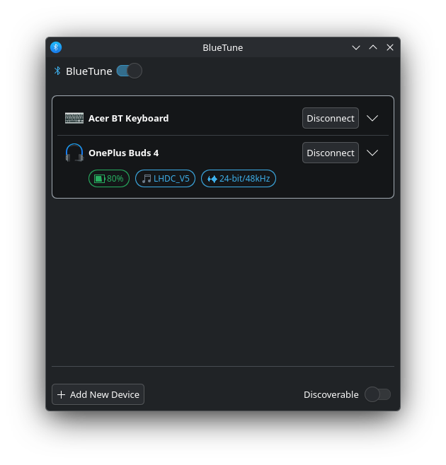
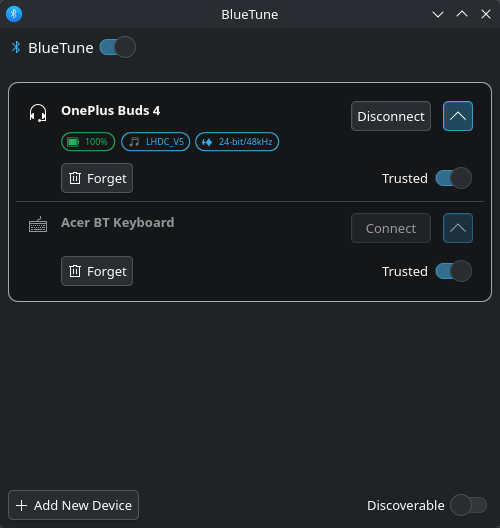

# BlueTune

**A native KDE Plasma 6 Bluetooth manager — with the audio detail BlueDevil never showed you.**

BlueDevil tells you a device is connected. It won't tell you what codec it's using, what sample rate, or how much battery it has left. BlueTune shows all of that, plus everything BlueDevil does: connect, disconnect, trust, forget, adapter power, discoverability, and pairing new devices — all from one system tray dropdown.




## Why BlueTune

KDE's built-in Bluetooth applet is fine for basic pairing, but if you actually care about your audio — whether your earbuds negotiated LDAC or fell back to SBC, whether you're getting 24-bit/96kHz or 16-bit/44kHz, how much battery is left before your call drops — it simply doesn't tell you. BlueTune was built to fill exactly that gap, then grew into a full replacement: every paired device (audio or not) in one place, with the controls to manage it.

## Features

- **Live audio detail** — codec (LDAC, aptX, SBC, …) and sample format, read directly from PipeWire, for every connected audio device
- **Battery level**, color-coded by severity, for any device that reports one
- **All paired devices in one card** — audio gear, keyboards, mice, phones, anything paired to your adapter — not just audio
- **Connect / Disconnect** any device with one click, with a live busy indicator
- **Trust** and **Forget** per device, with a confirmation dialog before forgetting
- **Adapter controls** — power and discoverability toggles, right in the dropdown
- **Add New Device** — launches KDE's own pairing wizard, so pairing works exactly like it always has
- **System tray icon** with a live count badge showing how many devices are connected
- Fully **theme-aware** — light/dark/accent color all follow your Plasma color scheme automatically, no restart needed

## Screenshots

| Dropdown overview | Per-device controls |
|---|---|
|  |  |

| System tray icon |
|---|
|  |

## Prerequisites

BlueTune is a thin UI over tools KDE Plasma already ships with — nothing needs installing beyond a normal Plasma 6 desktop:

- **KDE Plasma 6.0.4** or newer
- **BlueZ** + **bluez-qt** (`org.kde.bluezqt` QML module) — device/adapter state
- **PipeWire** or **PulseAudio** with `pactl` on `PATH` — codec/sample-format info (BlueZ itself has no codec data over D-Bus)
- **BlueDevil** installed — only needed for the "Add New Device" button, which launches BlueDevil's own pairing wizard (`bluedevil-wizard`) rather than reimplementing pairing from scratch

If you're running a stock KDE Plasma 6 desktop, you already have all of this.

## Installation

### Option A — Install the package (recommended for most people)

1. Download the latest `bluetune.plasmoid` from [Releases](../../releases).
2. Install it:
   ```bash
   kpackagetool6 --type Plasma/Applet --install bluetune.plasmoid
   ```
   Or, without a terminal: right-click your desktop or panel → *Add Widgets…* → *Get New Widgets…* → *Install Widget From Local File…* → pick the downloaded file.
3. Right-click your panel or system tray → *Add Widgets…* → search **BlueTune** → drag it into place.

To update later, re-run the install command with `--upgrade`:
```bash
kpackagetool6 --type Plasma/Applet --upgrade bluetune.plasmoid
```

### Option B — Install from source (for development)

```bash
git clone https://github.com/rupeshofficedata/BlueTune.git
ln -s "$(pwd)/BlueTune" ~/.local/share/plasma/plasmoids/org.rupesh.bluetune
```

Then add it via *Add Widgets…* as above. Editing the QML afterwards applies on next panel-widget reload (remove and re-add the widget, or `systemctl --user restart plasma-plasmashell` for a guaranteed-fresh reload).

## Development

- `metadata.json` — plasmoid manifest (KPackage)
- `contents/ui/main.qml` — widget UI (compact tray icon + dropdown), reactive device/adapter state via `org.kde.bluezqt`
- `contents/scripts/bt-audio-info.sh` — polls `pactl` for codec/sample format per connected Bluetooth audio sink (BlueZ has no codec info over D-Bus, so this part stays a shell script)

See `PLAN.md` for the full build history and `CLAUDE.md` for architecture notes and known gotchas if you're extending this.

## License

MIT — see [LICENSE](LICENSE).
